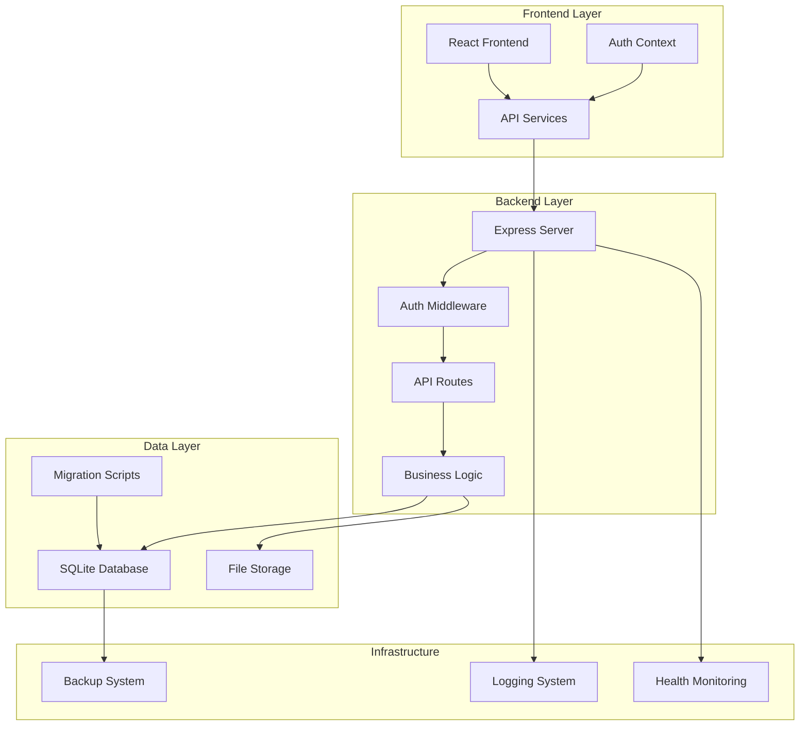
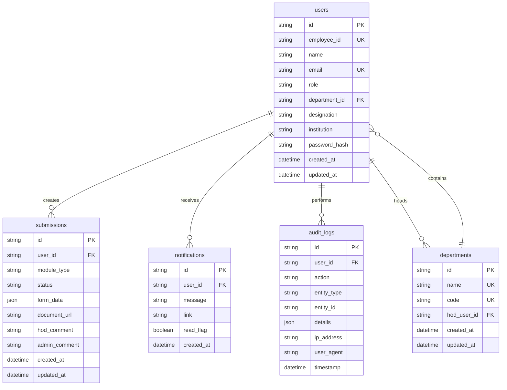
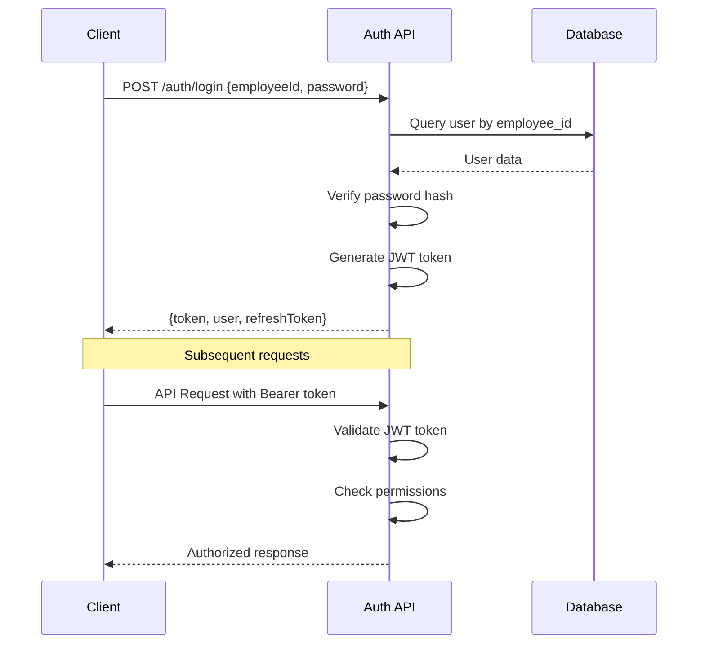

# Design Document

## Overview

This design document outlines the architecture for migrating the Faculty Development Tracking System (FDTS) from Supabase to SQLite with a robust Node.js/Express backend. The migration will create a self-contained, production-ready system while maintaining full backward compatibility with the existing React frontend.

The new architecture will consist of:
- SQLite database with optimized schema and indexing
- Node.js/Express REST API server with comprehensive middleware
- JWT-based authentication system
- Local file storage with security controls
- Database migration and seeding utilities
- Comprehensive logging and monitoring

## Architecture

### High-Level Architecture



### Database Architecture

The SQLite database will mirror the current Supabase schema with optimizations:



## Components and Interfaces

### 1. Database Layer

**SQLite Database Manager**
- Connection pooling and management
- Transaction handling
- Query optimization
- Schema migrations
- Data validation

**Key Features:**
- WAL mode for better concurrency
- Foreign key constraints enabled
- Proper indexing for performance
- Automated backup scheduling

### 2. Authentication System

**JWT Authentication Service**
- Token generation and validation
- Password hashing with bcrypt
- Session management
- Role-based access control

**Authentication Flow:**


### 3. API Layer

**RESTful API Endpoints**

Core endpoints maintaining backward compatibility:

```
Authentication:
POST   /api/auth/login
POST   /api/auth/refresh
POST   /api/auth/logout

Users:
GET    /api/users
POST   /api/users
GET    /api/users/:id
PUT    /api/users/:id
DELETE /api/users/:id

Submissions:
GET    /api/submissions
POST   /api/submissions
GET    /api/submissions/:id
PUT    /api/submissions/:id
DELETE /api/submissions/:id
GET    /api/submissions/my
GET    /api/submissions/department

Departments:
GET    /api/departments
POST   /api/departments
PUT    /api/departments/:id

Files:
POST   /api/files/upload
GET    /api/files/:path
DELETE /api/files/:path

System:
GET    /api/health
GET    /api/metrics
```

**Middleware Stack:**
1. CORS handling
2. Request logging
3. Rate limiting
4. Body parsing
5. Authentication verification
6. Authorization checks
7. Input validation
8. Error handling

### 4. File Storage System

**Local File Storage Manager**
- Organized directory structure
- File validation and security
- Access control
- Cleanup utilities

**Directory Structure:**
```
uploads/
├── submissions/
│   ├── {userId}/
│   │   ├── {submissionId}/
│   │   │   ├── certificate.pdf
│   │   │   └── brochure.pdf
├── temp/
│   ├── {sessionId}/
│   │   └── temp_file.pdf
└── system/
    ├── backups/
    └── logs/
```

### 5. Migration System

**Database Migration Manager**
- Schema creation and updates
- Data migration from Supabase
- Rollback capabilities
- Validation and verification

**Migration Process:**
1. Export data from Supabase
2. Transform data format
3. Create SQLite schema
4. Import transformed data
5. Verify data integrity
6. Create indexes and constraints

## Data Models

### User Model
```typescript
interface User {
  id: string;
  employeeId: string;
  name: string;
  email: string;
  role: 'faculty' | 'hod' | 'admin';
  departmentId: string;
  designation: string;
  institution: string;
  passwordHash: string;
  createdAt: Date;
  updatedAt: Date;
}
```

### Submission Model
```typescript
interface Submission {
  id: string;
  userId: string;
  moduleType: 'attended' | 'organized' | 'certification';
  status: SubmissionStatus;
  formData: any;
  documentUrl?: string;
  hodComment?: string;
  adminComment?: string;
  createdAt: Date;
  updatedAt: Date;
}
```

### API Response Model
```typescript
interface ApiResponse<T = any> {
  success: boolean;
  data?: T;
  message?: string;
  error?: string;
  timestamp: string;
}

interface PaginatedResponse<T> extends ApiResponse<T[]> {
  pagination: {
    page: number;
    limit: number;
    total: number;
    totalPages: number;
  };
}
```

## Error Handling

### Error Classification
1. **Validation Errors** (400) - Invalid input data
2. **Authentication Errors** (401) - Invalid credentials
3. **Authorization Errors** (403) - Insufficient permissions
4. **Not Found Errors** (404) - Resource not found
5. **Conflict Errors** (409) - Data conflicts
6. **Server Errors** (500) - Internal server errors

### Error Response Format
```typescript
interface ErrorResponse {
  success: false;
  error: string;
  details?: any;
  timestamp: string;
  requestId: string;
}
```

### Error Handling Strategy
- Centralized error handling middleware
- Structured error logging
- User-friendly error messages
- Automatic error reporting for critical issues

## Testing Strategy

### Unit Testing
- Database operations testing
- Authentication logic testing
- API endpoint testing
- Utility function testing

### Integration Testing
- End-to-end API workflows
- Database transaction testing
- File upload/download testing
- Authentication flow testing

### Performance Testing
- Database query performance
- Concurrent user handling
- File upload performance
- Memory usage optimization

### Migration Testing
- Data integrity verification
- Performance comparison
- Rollback procedure testing
- Edge case handling

## Security Considerations

### Authentication Security
- Password hashing with bcrypt (12+ rounds)
- JWT token expiration and refresh
- Secure token storage recommendations
- Rate limiting on authentication endpoints

### API Security
- Input validation and sanitization
- SQL injection prevention
- XSS protection headers
- CSRF protection
- Rate limiting per endpoint

### File Security
- File type validation
- Size limitations
- Virus scanning integration
- Access control verification
- Secure file serving

### Database Security
- Prepared statements for all queries
- Connection encryption
- Regular security updates
- Access logging and monitoring

## Performance Optimization

### Database Optimization
- Strategic indexing on frequently queried columns
- Query optimization and analysis
- Connection pooling
- WAL mode for better concurrency

### API Optimization
- Response caching where appropriate
- Pagination for large datasets
- Compression for responses
- Efficient JSON serialization

### File Handling Optimization
- Streaming for large files
- Efficient file organization
- Cleanup of temporary files
- CDN integration possibilities

## Deployment and Infrastructure

### Environment Configuration
- Development environment setup
- Staging environment configuration
- Production deployment guidelines
- Environment variable management

### Monitoring and Logging
- Application performance monitoring
- Error tracking and alerting
- Database performance monitoring
- File system usage monitoring

### Backup and Recovery
- Automated database backups
- File system backups
- Recovery procedures
- Disaster recovery planning

### Health Checks
- Database connectivity checks
- File system health checks
- API endpoint health monitoring
- System resource monitoring